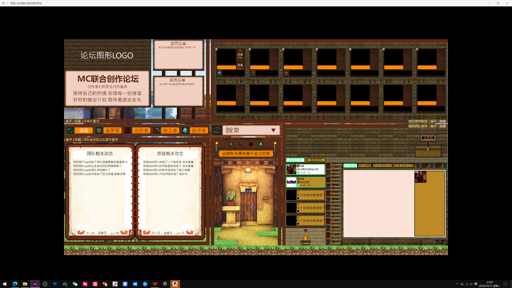
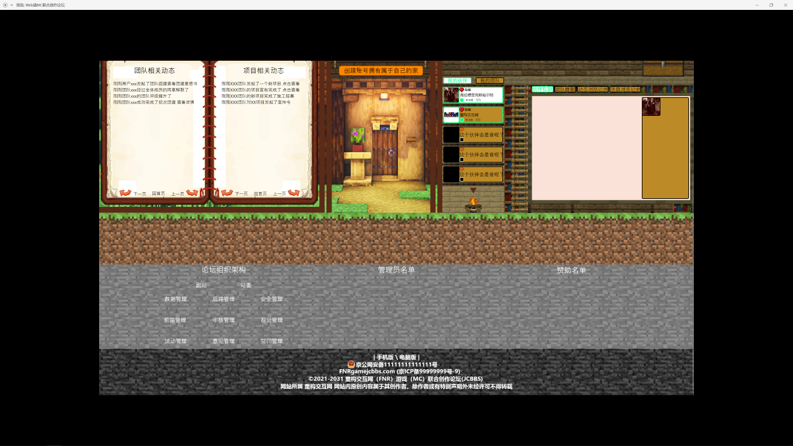

# 我的世界联合创作平台 项目 计划

## log
一会我把我做的高保真原型公开到群里，我会简单讲一下该原型，接下来的日子请大家好好沟通，然后开始开发工作。关于找钱的事情，如果在开发出前能找到钱，届时我希望早一些大家线下全职来做事，不过很大几率是在开发完之后，再去对接投资人跟机构，才能获取投资。
重构交互网最终的事业使命是实现我国信息产业的崛起，就是让我国纯国产的操作系统和软件可以走向世界，而不只是成为巨头后，只是在国内作威作福
腾讯对整合创新生态的伤害是极大的，总之不说这些了
在网易代理我的世界后，只有一小部分的内容创作者们选择在网易代理的我的世界之下做事，也就是开发模组、材质、光影、自定义地图等内容。
然而绝大部分的内容创作者们依然支持的是非国区，也就是国际服
这个原因主要就是网易代理的我的世界是非常典型的，就是为了钱而代理
并没有真正做好内容，没有服务好热爱我的世界的玩家群体们
在这个大背景下，那些真正热爱我的世界的，为了热爱而发电的那些独立创作者们过的一直都很苦他们没有获得任何支持，却一直在为了热爱而不求回报的在买单
就像现在我国几百万的有着不同能力的想要开发独立游戏的游戏开发者们一样
他们没有一个好的创作环境，那些狗屁大厂只会在像对待韭菜一样，看谁有可能会出一个有前途的Ip，才选择去投资一样
然而没有真正在用心扶持那几百万有着创作梦想的创作者们的公司。
无论是我的世界的内容创作圈还是我国整个独立游戏创作圈，现状都是一样的
美国还有个奈飞，只要你有好的创意，你可以来公司找人才找钱一起搞这个项目
但是在我们中国，你有想法和创意是不够的，你没有关系和人脉，在你没有获得一定知名度之前，没人会支持你
无论你是一个只会做模型的，还是只会写剧情当策划，还是你会做音乐，你有能力也有想法，是很难获得支持去完成独立游戏的
我的世界的内容创作者们也是一样，无论你有什么能力和想法，你基本上只能靠自己做事，没有人会帮你，你很难遇到可以一同做事的志同道合的伙伴
前面我分享的那个虚无世界三的项目，我找了两个技术，一个写剧情的，最后找流量最高的博主去做事情…总之凑齐这些伙伴，我花了很多精力，总而言之，内容创作者们现在是很难凑在一起做事的
既然现在没有可以让内容创作者们凑到一起做事的平台，我为什么不带人做一个
产生这个想法后，我花了很多时间做市场调研
我创业至今接触了很多独立开发者
他们有的会编程，有的会做模型，有的是画师有的会做音乐有的是写小说的，甚至还有喜欢画地图的
他们都有一个共同的需求，做独立游戏
每一个我都问了，为什么不实践起来,他们说，工程量高，个人能力不够，那我问，找人啊,他们大部分说找不来，现在在网络上大家都是虚拟身份,很难找到真正有能力的并且也靠谱的伙伴一起做事,大部分都是这个回答,最后的结果是绝大部分只能被迫成为一个独立制作者，然后录一些自己来打游戏的视频，做自媒体,像黑神话，米哈游，他们最初也是看着一点一点找人，找钱，才最终做成事情的，然而在如今的整个创新生态面前，这种只会是极少数
绝大部分有想法，有创意，有能力做独立游戏或影视内容的，只能被埋没在如今这个创新生态之中
备注：主要决定创新生态的是交互生态，也就是社交网络生态
在我们越来越依赖网络社交、现实中社恐越来越多的情况下
绝大部分人获取伙伴的渠道，只有网络,你们几个都是高材生,现实中在面对面都很难遇到能够相互信任和理解的人,更何况在网上了,总而言之，现在绝大部分有想法的，想做成点什么事情的,都是孤独的，很难结识到志同道合的伙伴,这是以虚拟社交为主流的网络社交生态导致的结果,
类似于脉脉那种人脉软件？根据不同筛选人？
内容创新生态因为主要依赖于社交网络，所以创新生态环境自然也越来越差了
那就说说脉脉，你们谁用过,在上面成功建立起值得信任的伙伴关系了吗？
然而能够解决内容创作者们彼此难以相互结识、共事的需求的社交软件会是虚拟社交跟真实社交的结合，也就是在相互认识的功能部分，这些内容创作者们有渠道相互以虚拟身份去建立好友关系
然后提供给他们可以一起建立共事等深度的好友关系的功能，再转到真实社交
举例
我跟白白在联合创作平台上认识了
然后我有一个标签，那就是我想做独立游戏，我认证的能力是策划、剧情文案，然后我发了一个需求，我想认识技术伙伴。
白白标签也是想做独立游戏
白白认证的能力是编程，然后白白发的需求是认识策划，剧情文案
然后在这个情况下，我们会被在这个特定的功能部分，相互被推送，结识
这是认识的部分，然后是建立深度好友关系的功能
在我们相互结识的情况下，我们需要沟通，交流理想，追求，热爱什么的
然后交流到一定程度，我们其中一方可以提出一起在联合创作平台中，共同成立一个联合创作团队的需求
当两个人都同意后…我跟白白发起的成立一个联合创作团队的需求就会被公开，发起目标是开发独立游戏
然后这个需求在特定的公告栏部分，这个需求会被别人看到
别人便可以申请加入

盈利是吧，这些联合创作团队产出的内容一共有几类
一种是可以运营的服务器
二是支持定制 家园(就是每个用户有一个自己的家园)

不单单以后会自己运营自媒体平台，甚至会做中国的steam

联合创作平台的商业模式建立在互联网信用体系应用进社交网络的这个大的事业方向之中
现在国内外的社交巨头，你们肯定都知道
他们提供的社交产品整合了互联网普罗大众，拥有极高的用户体量
然而为什么，内容创作者们还是很难一起共事，我们人与人彼此还是很难在网络上结识到高质量的朋友
这是因为现在的社交网络没有互联网信用体系作为支撑。
互联网信用体系一直以来，现在主要被应用在金融之中
然而社交网络也需要信用体系
注：本质上联合创作就是社交产品。
即时通讯+互联网信用体系就是高价值社交，我称它价值通讯或延续通讯，延续通讯不好听就叫价值通讯
价值通讯社交产品的价值就是通过维持住用户之间的社交关系，进而去产出价值
联合创作服务只是产出的价值之一
懂就行，如何把信用体系应用进社交网络才是最主要的，这很难。
这里我就不讲了，总之，联合创作服务只是把互联网信用体系应用进社交网络所能够进而创造出的创新商业模式之一。
降低用户之间在网络上建立高价值的交互关系的所需成本
降低用户之间在网络上产生负面交互作用的可能。
是的，把互联网信用体系应用进社交网络，需要相匹配的交互规则
像前面讲的，在联合创作平台中，我跟白白怎么才能结识，怎么才能一起一起建立团队，这些都属于具体的交互规则
驱动力体现在有驱动力的交互规则上，驱动力的具体效率又取决于在具体规则下所积累的用户行为数据或互联网信用体系自身的数据体量。
重构交互网收集的数据体量能达到一定程度后再提供即时通讯产品，届时就是中国互联网格局彻底变天的那一天
人心需要教育，软件产品不能只停留在解决用户需求的层面上，真正伟大的交互产品应该具备对用户的正向驱动或引导作用。
这就像现在的绝大部分软件产品，只是解决用户需求，但因为交互规则的问题，其中滋生了很多暴击跟伤害
如果现在在各种社交产品中，你骂人又过去像白白前面说的诈骗一个人后，被别人进行一个负面评价，并且这种社交信用分也会公开，那么仅仅是靠着这点功能，随着时间，网络也会具备清洁素质低的人的功能。
那些受网络暴力的人也不会像现在这样过的痛苦，难以维权。
我知道创新环境很差，很多人能做出产品活下来就已经很难了，更别说还能真正靠着产品来造福社会

昨天晚上我大概讲了一下，剩下要说的就是围绕这个原型的各个功能板块来讲了，不同的功能板块有不同的功能。
这个交互原型，我一共分成了五个板块。最上面有四个，最下面往下拉，才可以看到第五个。
这些功能板块围绕一个最核心的功能展开。这个最核心的功能叫“根据用户类型呈现内容。”
每一个用户在进入这个论坛时，他的身份默认是游客
在注册账号成功登录后，再次打开这个论坛，用户身份就是后面那四类
每一个用户注册账号后，他可以通过验证他的具体身份、具体能力、具体经济实力、是不是博主，来开启不同的用户类型身份。
在不同的用户身份类型情况下进入这个论坛，这个用户可以相应的在不同的功能板块获取到他所需要的信息。
举例：一个认证了投资者身份的用户，他可以在项目宣传板块看到正在寻求投资的项目宣传书。
但是如果没有认证投资者身份的用户，他即便可以看到一个正在宣发的项目，但是他是看不到这个项目正在融资的这部分信息的。
同理，一个认证的施工者身份的用户，他可以看到正在寻找施工（或是做模型、或是做建筑、或是当策划这剧情等等）伙伴的项目书。
这便是这个论坛最核心的基础功能，即“根据用户类型呈现内容。
不同类型的用户会开启不同的功能，鉴赏家是博主，也就是有能力把项目成品最终输出到自媒体渠道的人。
仅仅是勾选并不够，我们必须保证用户之间在这个平台上，彼此填入的身份、能力、想法等信息是真实的
唯有做到这一点，我们才能保证内容创作者们能够靠谱的共事到一起
还需要记录动态的用户行为数据来作为判断用户身份的主要保障，比如一个认证了施工者身份的用户，即便他认证了软件工程学院的学历
但是他一次项目施工也没有参加过，也没有获取过别人的评价，没跟别人共事过，那么这种没有积累用户口碑的用户，他依然参加不了一些要求，必须有多次施工经验的项目团队之中去
总而言之，用户身份认证部分，是开发最困难的工作部分，也是决定整个联合创作平台能否解决核心用户们的核心需求的核心。

我们就要讲各个用户们在不同的用户身份下在这个论坛中，每个板块里面都会呈现什么信息了。
首先各个板块呈现出来的信息是该类型的用户日常所需要浏览的信息，而不是不许浏览的信息。
现在绝大部分网站所呈现出的绝大部分信息都是我们不需要的信息
就像我们在一个搜索网站面前，我们其实需要的仅仅是一个搜索栏一样
我们不需要那些广告，那些杂七杂八的复杂功能,现在所有的各个端的软件基本上在提供核心功能的基础上，都会提供一些子功能，绝大部分的子功能都没什么实际价值，也降低了很多用户体验，降低了核心用户使用这个软件来解决核心需求的交互效率。
联合创作平台所解决的核心用户需求，转换成一句大白话，就是让大家可以跟志同道合的人一起做成想做的事情。
总而言之，核心用户们的核心需求我们需要把握好，不需要提供没有价值的功能。

首先我给大家介绍一个通用板块功能区.也就是搜索框下面,那个最中心的位置,你们可以理解成用户主页过用户中心
不过我们的联合创作平台，用户中心跟游戏一样,每一个用户在注册的过程中，就跟建一个自己的家一样
他可以完全定制自己在平台里的虚拟身份,形象，布置他的家,用户之间也可以逛彼此的家,用户也可以把日常获得或收集的一些成就，礼物，奖杯，荣誉,布置在家里,也就是说，我们的用户中心绝不是死板的几个框框，然后里面填一些字，而是活的真正能把每名用户的青春、记忆、热爱活生生的表达出来、记录下来的用户中心
用户中心这个功能部分，是我们联合创新平台在运营早期就可以实现盈利、自我造血的功能部分
因为联合创作这个商业模式，注定我们需要花大把精力跟工作时间，放在如何维护好联合创作环境上，随着平台内的各种大大小小的联合创作团队的成熟 .直到他们逐渐做出高质量的内容以实现产生利益
在这之前，我们需要自己造血,我想，更生动的用户中心，在其中可以购买各种虚拟商品，用于用户们可以在平台上能够呈现各自的独特个性,这样设计用户中心，最合理不过了,关于用户中心的更多细节，我就不讲了，用户中心大概的意思就是这样

大体用户中心的交互如何像游戏一样呈现,大体就是点开那个门，然后右边的聊天区隐藏在最右侧边框。
然后用户中心这个部分从右侧展开,动画上就是用户的形象，打开门,进入到室内,每一个用户的房间，大小都不一样，有钱的可以直接买一个城堡的情景,普通用户就是普通的小家的情景,可以布置，可以装修，移动家具，每一个房间都可以定制，也有用户用于呈现成就、奖励、奖杯等藏品的…空间,用户彼此之间可以相互串门（就是我们看彼此的用户资料）,参观彼此的家

凯泽是美工，提供项目设计到的美术内容，用户中心涉及到的虚拟商品内容（虚拟商品我们不用AI做）

大致计划、
一：讲解产品原型，让所有参与者对产品有基本的认识脉络。
二：做完整项目书。
三：开发。
四：内测。
五：运营前工作①：投融资，开发完后，我会带着产品去跑投资。
六：运营前工作②：拿到投资，确定线下办公地址，开会分配股权，大家全职到线下办公。
七：开始运营

接下来几天，我会讲完这个原型，这个星期肯定能讲完

讲完后，我带大家一起做项目书

现在我讲到的一定都要理解透啊，这是创新项目，需要创新思维，一定跳出既定思维对待这个项目，这个产品市面上没有可参照的产品，最像的是DAO，但也仅仅是像一点。总而言之，在我带大家一起做项目书之前，讲原型的最后这几天，大家有问题一定要即时反馈，沟通。创业文化最重要的是坦诚交流，我肯定从我这里以身作则，总之，大家想说啥就说啥，只要是出于对项目好、对团队好的立场，有啥说啥

1.项目立意: 联合创作自组织平台 (先做MVP, 最小可行性产品)
2.面向的用户: 我的世界内容创作者, 服务于包括但不限于做模组、建筑、音乐、动画、模型、文案剧情等
3.解决的需求:为内容创作者提供一个可以把彼此之间的能力、资源、想法聚集起来的联合创作环境，解决有着不同能力、资源、想法的内容创作者们在网络上很难结识到靠谱的伙伴来一起共同创作出更为优质的内容需求
所选技术 Vue + SpringBoot + PostgreSQL + ...
主要开发内容: 虚拟商品及其交易功能