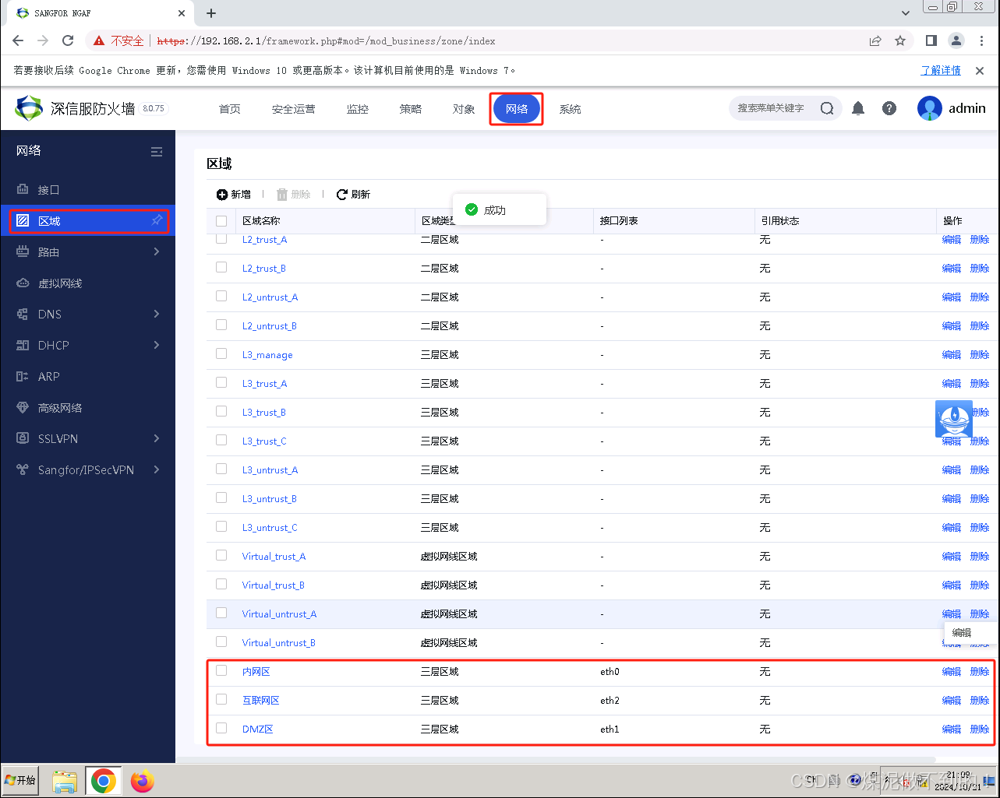
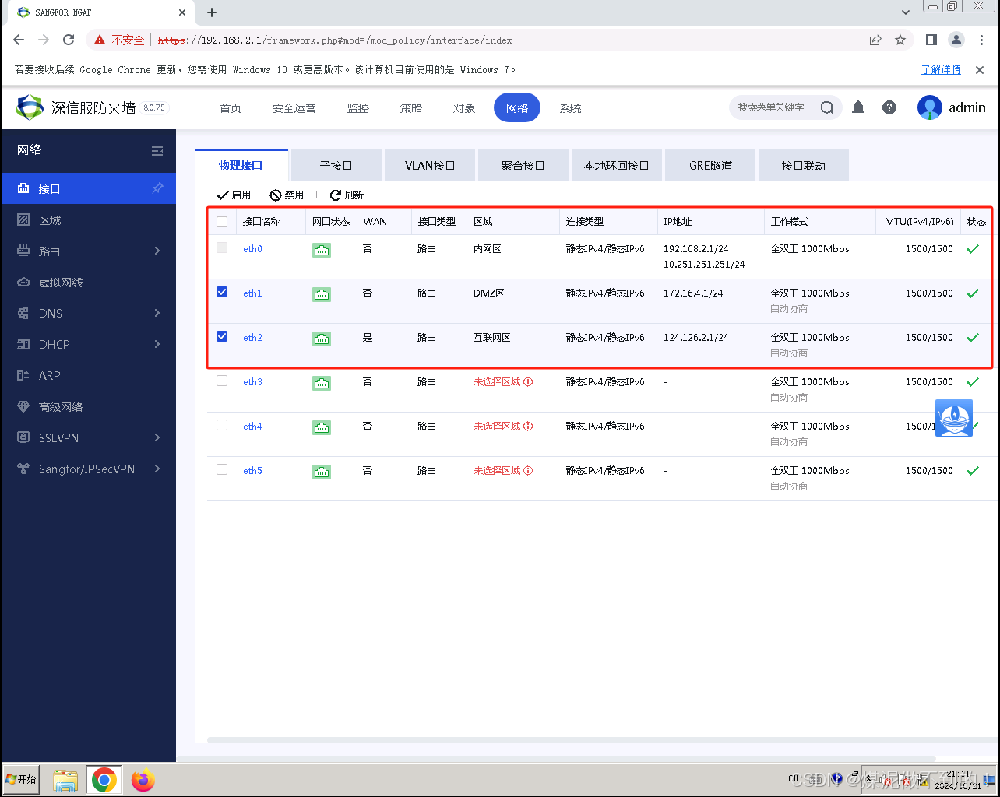
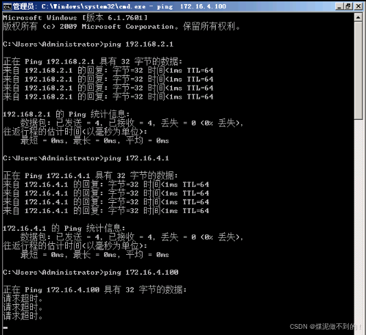
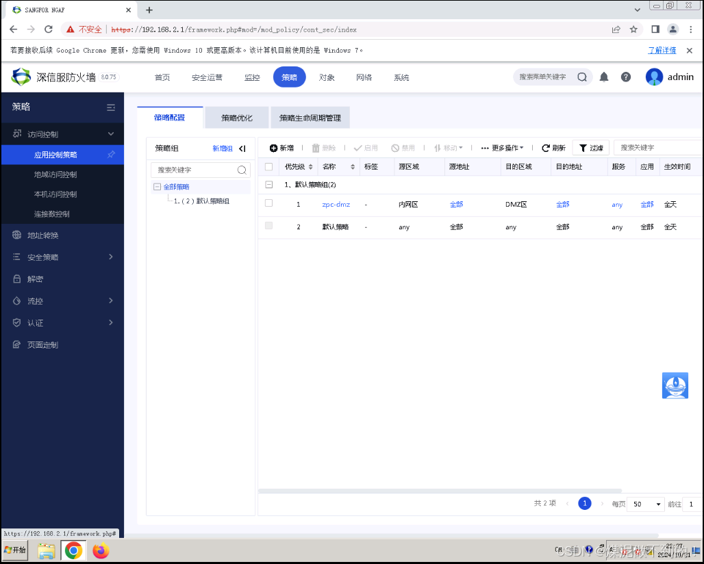
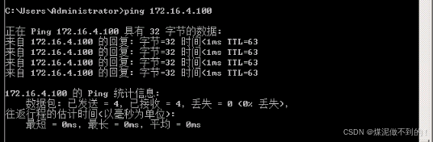
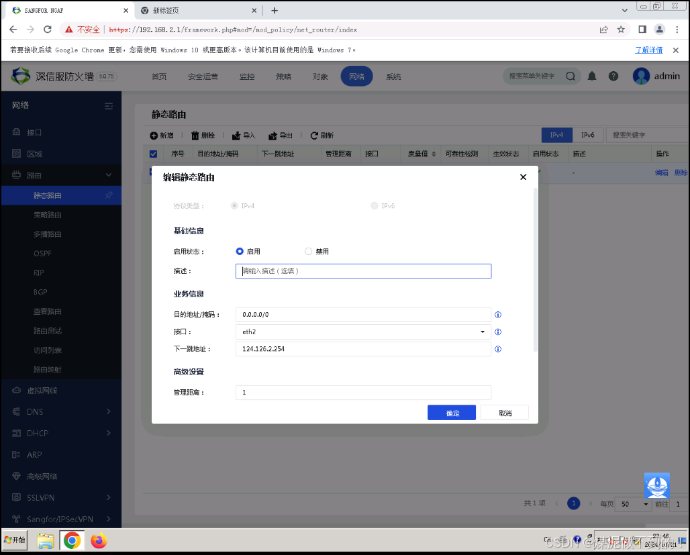
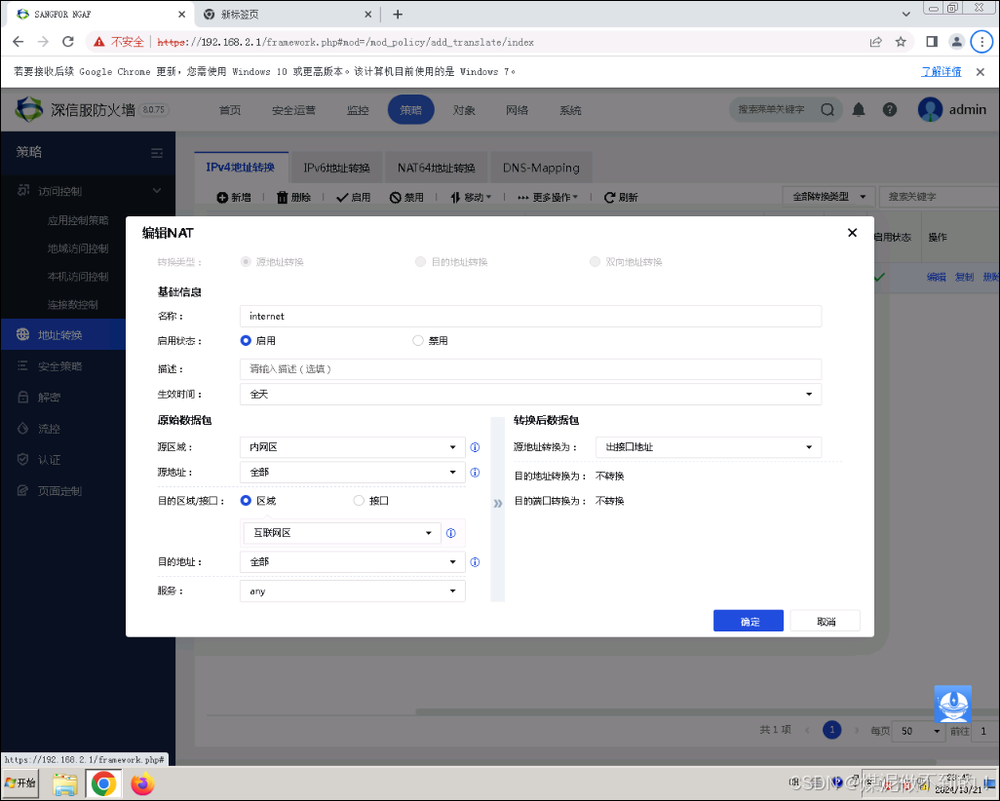
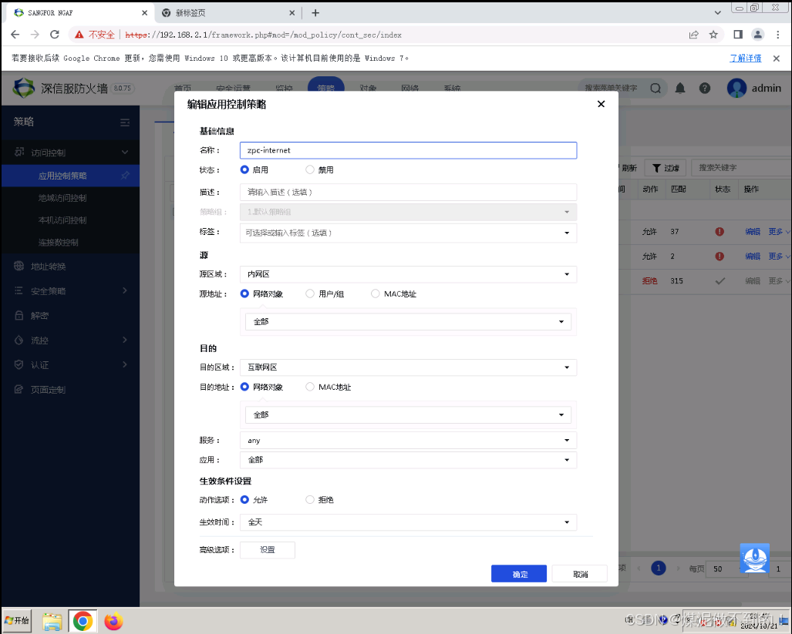
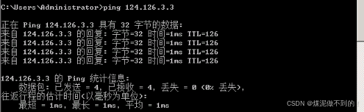

```sh
https://vpn.yinhepx.com:4433
```
# 实训报告
## 1 实习背景
## 2 实习内容
根据每一组学生实训的实际任务对目录进行调整，要求写出实习任务相关技术的原理和作用、配置或调试的过程以及相应的说明、测试的结果。
不允许图或表没有任何文字的连续排版
### 2.1 全网行为管理	
### 2.1.1 AC的路由模式部署	
### 2.1.2 用户认证	
### 2.1.3访问权限控制	
### 2.1.4 HTTPS阻断技术	
### 2.1.5 WEB关键字过滤技术	
### 2.1.6流量控制技术	
### 2.1.7用户限额策略	
### 2.1.8惩罚通道技术	
### 2.1.9 HTTPS内容识别与管理	
### 2.1.10审计技术	
### 2.2 下一代防火墙	
### 2.2.1 AF路由模式部署	
### 2.2.2 AF端口映射	
### 2.2.3 防火墙应用控制策略	
### 2.2.4 DOS防护	
### 2.2.5 网关杀毒	
### 2.2.6 僵尸网络检测与防御	
### 2.2.7 漏洞攻击防护	
### 2.2.8地域访问控制	
### 2.2.9勒索病毒专项防护	
## 3实习总结	

# AC 操作笔记
AC 登录方法：
	默认管理口有两个eth0口 登录地址10.251.251.251/24 和eth1口10.252.252.252/24将本地电脑IP地址改为同网段并和AF的eth0口或eth1口连接，在浏览器输入https：//10.251.251.251或https：//10.252.252.252/24即可登录，默认登录账号和密码为admin实验环境登录账号和密码是admin/wxjy@2012

路由模式部署：
	在 系统管理-网络部署-部署模式 选择路由部署，根据拓扑信息在对应接口下输入IP信息和nat（AC部署完以后会重启，重启时间大概是3-5分钟），然后在 系统管理-网络部署-路由 内新增缺省路由进行上网。

本地密码认证;
	先在 接入管理-用户管理-本地用户组/用户 里面新增加组，在组内新增用户信息（自己设置登录名和密码）。随后在 接入管理-接入认证-portal认证-认证策略 内点击新增，输入要认证的范围，选择认证方式为密码认证，认证服务器选择本地用户。认证后处理选择进入到刚刚创建的组内即可。

AD域使用：
	登录AD域设备，进如设备后先更改IP地址，保证pc可以和AD域进行通信，在 服务器管理器-右上角工具- ActiveDirectory用户和计算机-wxjy.com 内选择新建组织单位或用户。

外部密码认证
	在 接入管理-接入认证-portal认证-认证服务器 内点击新增LDAP服务器，服务器地址填写AD域的IP，管理员账号为Administrator@wxjy.com，在BaseDN选择组织架构wxjy.com。随后在 接入管理-接入认证-portal认证-认证策略 新建策略，认证范围选择内网IP，认证方式选择密码认证，认证服务器选择刚才新建的AD域，然后提交即可

应用控制策略：
	在 行为管理-访问权限策略 新增访问权限策略，选择需要管控的应用，选择处置动作，和选择策略适用对象，然后点击提交即可。

互联网/客户端/业务审计：
	在 行为审计-互联网/客户端/业务 新增需要审计的内容（客户端审计需要下载插件，在接入管理-准入客户端配置 可以下载）

流量控制策略
	在 流量管理-流控策略 先开启左上角“启用流量管理系统”（不然流控策略不生效），然后在 带宽分配-新增通道 新增一级通道，选择是要做保障通道或者是限制通道。
  
# AF 操作笔记
Unit 机架单元 1U = 4.445cm 1.75英寸

AF 登录方法：
	默认管理口eth0口 登录地址10.251.251.251/24 将本地电脑IP地址改为同网段并和AF的eth0口连接在浏览器输入https：//10.251.251.251即可登录，默认登录账号和密码为admin实验环境登录账号和密码是admin/wxjy@2012

接口配置：
在 网络-接口 点击想要配置的接口，确保接口状态是启用状态，类型选择路由，区域可以在接口下新建也可以在 网络-区域 内点击新增创建新的区域（需要注意创建三层区域）。基本属性可选可不选。地址配置选择IPv4，连接类型选择静态，直接输入想要配置IP地址（需要注意输入掩码）。根据需求勾选ping和webui选项。

路由配置：
如果需要跨网段通信那么需要配置对应的静态路由，在 网络-路由-静态路由 新增路由信息，若需要访问互联网，不要忘记做缺省路由。

区域间互访：
不同区域默认拒绝互相访问，如果有不同区域之间想要访问的需求，可以在页面的 策略-访问控制-应用控制策略 新增创建需要互访的策略（如果区域是外网区域的话，网络对象要选全部）。一定不能做any-any全放通策略！

地址转换：
如果防火墙部署在出口层当作出口路由器使用时，访问互联网时除了需要做缺省路由，还需要配置源地址转换 在策略-地址转换-IPv4地址转换 新增源地址转换（部署在内网当作核心路由器时不需要配置）
	若内网有相应的服务器对外发布业务想让外网用户访问时需要做目的地址转换，在 策略-地址转换-Pv4地址转换 新增目的地址转换，原始数据包的目的地址填写防火墙接口的公网IP地址，服务选择需要映射的服务端口，转化后数据包的指定IP填写内网服务器的IP地址，服务选择需要映射的服务

应用控制策略配置：
	若需要禁止访问一些网站或应用在 策略-访问控制-应用控制策略 点击新增，选择对应的应用或网站，动作选择允许或拒绝（拒绝策略最好放在第一条）

区域访问控制：
	如果想要只想让某一个国家或地区允许或拒绝访问我的内网，在 策略-访问控制-地域访问控制 新增策略，在控制方式里选择地区和处理动作

终端内容安全防护策略配置：
	在 对象-安全策略模板-内容安全 新增模板，在高级选项内勾选需要检查的内容，模板配置好以后在 策略-安全防护策略-新增业务防护策略 在内容安全选择栏里调用做的模板（尽量一个策略只做一个防护）

终端僵尸网络防护策略：
	在 对象-安全策略模板-僵尸网络 新增僵尸网络模板，然后在 策略-安全防护策略-新增业务防护策略 在僵尸网络模块进行调用（日志要勾选）

# 实验需求分析
  1.	互联网边界防护需求
（1）网络需求
	内网上网：缺省路由，源地址转换，区域间放通的策略
	内网服务器发布业务：目的地址转换，区域间放通
（2）分级分域保护原则
	三个网口要划分不同的区域
（3）网络访问控制
	服务器发布什么业务就映射什么端口（映射80端口出去）
（4）上网终端防护
	开启勒索病毒防护专项
	a：开启内容防护，勾选恶意链接
	b：漏洞防护和僵尸网络防护
（5）服务器防护
	开启web防护，开启地域访问控制

2.	上网行为管控需求
	开启上网认证并选择外部认证
	做限制通道，限制p2p应用流量
	做保障通道，保障网上银行网站和收发邮件的流量
	做应用控制策略禁止访问访问微博以及其他论坛等应用
	做互联网审计和客户端审计
pc登录密码：wxjy@2012
ac/af账号密码信息：admin/wxjy@2012
ad域账号信息：administrator/wxjy@2012 
linux服务器账号信息：af/sangfor

# 全网互通作业

实现全网互通，
总部的pc可以访问互联网和分支的服务器，
分支的pc可以访问互联网和总部的服务器，
互联网的pc也可以访问总部和分支的服务器
（做相应配置并截图测试）
```yaml name='默认环境下的拓扑结构'
互联网路由器:
  - eth0(124.126.0.254):
    互联网交换机0:
      - 内置端口: 互联网路由器(eth0:124.126.0.254)
      - 内置端口: 
        - 分支2区路由器(eth0):
          - eth0: 互联网交换机0
          - eth1: 
            分支2区交换机:
              - 内置端口: 分支2区WEB服务器(eth0(连到分支2交换机))
              - 内置端口: 分支2区PC(eth0(172.16.0.110,连到分支2交换机))
              - 内置端口: 分支2区aES(eth0(172.16.0.102,连到分支2交换机))
              - 内置端口: 分支2区aTrust(eth0(连到分支2交换机))
              - 内置端口: 跳板机设备管理PC(eth4)
  - eth1(124.126.1.254):
    互联网交换机1:
      - 内置端口: 互联网路由器eth1(124.126.1.254)
      - 内置端口:
        分支1区AC(eth2):
          - eth0: 
            分支1区内网交换机:
              - 内置端口: 分支1区PC(eth0:192.168.1.100)
              - 内置端口: 跳板机设备管理PC(eth3)
          - eth1: 
            分支1区DMZ交换机:
              - 内置端口: 分支1区AD域(eth0:172.16.1.100)
              - 内置端口: 分支1区AC(eth1)
              - 内置端口: 跳板机设备管理PC(eth6)
          - eth2: 互联网交换机1
  - eth2(124.126.2.254):
    互联网交换机2: 
      - 内部端口: 互联网路由器(eth2(124.126.2.254))
      - 内部端口: 
        总部AF(eth2):
          - eth0: 总部内网交换机
            - 内置端口: 总部PC(eth0)
            - 内置端口: 总部AF(eth0)
            - 内置端口: 跳板机设备管理PC(eth2)
          - eth1: 
            总部DMZ交换机:
              - 内置端口: 总部WEB服务器(eth0)
                - eth0: 总部DMZ交换机
              - 内置端口: 总部AF(eth1)
              - 内置端口: 跳板机设备管理PC(eth5)
          - eho2: 互联网交换机2
  - eth3(124.126.3.254)
    互联网交换机3:
      - 内置端口: 互联网路由器(eth3(124.126.3.254))
      - 内置端口: 互联网区PC(eth0(124.126.3.3))
      - 内置端口: 互联网区WEB服务器(eth0(124.126.3.2))
      - 内置端口: 跳板机设备管理PC(eth1)
```

# AF 作业

总部区域有一台AF当作出口路由器，在AF上做相关配置，满足内网PC和服务器以及互联网要处于不同的区域，和需要让总部PC可以正常访问互联网区域的WEB服务器和总部的WEB服务器。（做相关配置，截图并测试）
AF登录：

  
  
  
  
配置区域间策略
  
总部pc可以访问总部web服务器
  
配置缺省路由，源地址转换，区域间放通的策略
  
  
  
可以ping通，完成
  


# 补充说明
AF 和 AC 配置的时候截图请详细一些, 截图请配上文字说明(不用太长)
登录: http://stu.hnwxjy.cn:63096/login?redirect=%2Fuserreserve%2Fmyreserve
页面左上角有个 异速连客户端 点击安装桌面客户端
账号: sx26
密码:123456
首页可以预约机架, 只能预约 sa 机架
一台可以预约 7个小时
深信服（Sangfor）提供的网络实验平台通常需要预约机架，并且可能需要使用远程桌面来访问和操作实验环境。以下是一些常见的步骤和要求：

### 1. 预约机架

在进行网络实验之前，通常需要预约实验机架。机架预约系统允许用户选择实验时间和所需的设备资源。以下是预约机架的一般步骤：

1. **登录预约系统**：访问预约系统的登录页面，输入用户名和密码进行登录。
2. **选择实验时间**：在预约系统中选择合适的实验时间段。
3. **选择设备资源**：选择所需的设备资源，如路由器、交换机、防火墙等。
4. **提交预约**：确认预约信息并提交预约请求。

### 2. 远程桌面访问
```sh
mstsc
172.16.2.106
```

预约成功后，用户通常需要通过远程桌面访问实验环境。远程桌面允许用户在本地计算机上操作远程服务器或虚拟机。以下是远程桌面访问的一般步骤：

1. **获取远程桌面信息**：在预约系统中查看远程桌面的 IP 地址、端口号和登录凭证。
2. **启动远程桌面客户端**：在本地计算机上启动远程桌面客户端（如 Windows 的远程桌面连接、macOS 的 Microsoft Remote Desktop 等）。
3. **输入远程桌面信息**：输入远程桌面的 IP 地址、端口号和登录凭证，连接到远程服务器或虚拟机。
4. **进行实验操作**：在远程桌面环境中进行网络实验操作，如配置设备、运行测试等。

### 示例：预约机架和远程桌面访问

假设你需要进行一次网络实验，以下是预约机架和远程桌面访问的示例步骤：

#### 1. 预约机架

1. 访问预约系统的登录页面：
   ```
   http://stu.hnwxjy.cn:63096/login?redirect=%2Fuserreserve%2Fmyreserve
   ```
2. 输入用户名和密码进行登录。
3. 在预约系统中选择合适的实验时间段。
4. 选择所需的设备资源，如路由器、交换机、防火墙等。
5. 确认预约信息并提交预约请求。

#### 2. 远程桌面访问

1. 在预约系统中查看远程桌面的 IP 地址、端口号和登录凭证。
2. 启动远程桌面客户端（如 Windows 的远程桌面连接）。
3. 输入远程桌面的 IP 地址、端口号和登录凭证，连接到远程服务器或虚拟机。
4. 在远程桌面环境中进行网络实验操作，如配置设备、运行测试等。

### 深信服网络实验平台的特点

深信服的网络实验平台通常具有以下特点：

1. **多设备支持**：支持多种网络设备，如路由器、交换机、防火墙等。
2. **虚拟化支持**：支持虚拟化技术，提供虚拟机和虚拟网络环境。
3. **远程访问**：支持远程桌面访问，便于用户在本地计算机上操作远程实验环境。
4. **预约系统**：提供机架预约系统，便于用户选择实验时间和设备资源。

### 总结

深信服的网络实验平台通常需要预约机架，并且可能需要使用远程桌面来访问和操作实验环境。通过预约系统选择实验时间和设备资源，然后使用远程桌面客户端连接到远程实验环境，进行网络实验操作。

如果你有具体的部分需要进一步优化或详细讨论，请告诉我。
