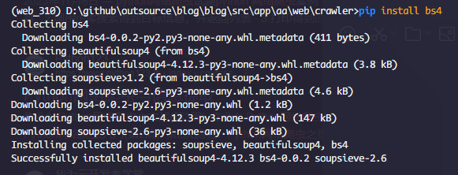
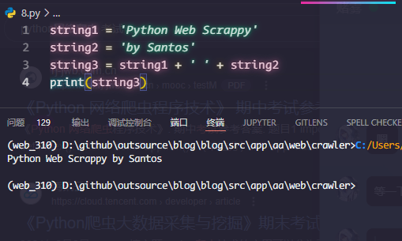
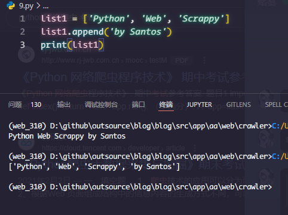
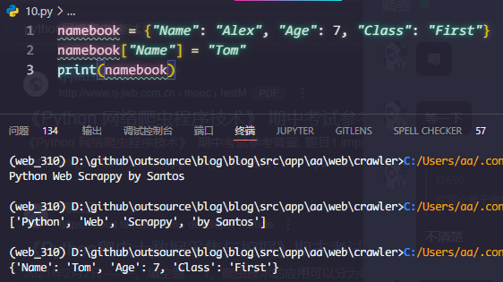

## 二、Python基础编程题（共5题，每小题4分，满分20分）
6. Anaconda或者Python安装包自带了pip，请使用pip安装第三方库bs4。

```sh
pip install bs4
```
  

7.使用编辑器Jupyter编写Python程序，向屏幕输出hello world!。
  

8.已知string1 = 'Python Web Scrappy'，string2 = "by Santos"，请定义string3，打印string3输出Python Web Scrappy by Santos。

```py
string1 = 'Python Web Scrappy'
string2 = 'by Santos'
string3 = string1 + ' ' + string2
print(string3)
```
  


9.已知list1 = ['Python', 'Web', 'Scrappy']，请给列表添加值by Santos。
```py
list1 = ['Python', 'Web', 'Scrappy']
list1.append('by Santos')
print(list1)
```
  

10.已知namebook = {"Name": "Alex", "Age": 7, "Class": "First"}，请给字典中的值Alex修改为Tom。
```py
namebook = {"Name": "Alex", "Age": 7, "Class": "First"}
namebook["Name"] = "Tom"
print(namebook)
```
  

## 三、代码分析题（共5题，每小题4分，满分20分）
11.分析以下代码片段的运行结果。
```py
book = "java"  #定义字符串book
if book == "python":   #判断变量是否为'python'
    print ("You are studying python.")  #条件成立时输出
elif book == "java":  #判断变量是否为'java '
    print ("You are studying java.") #条件成立时输出
else:
  print ("Wrong.") #条件不成立时输出
```
输出:
```sh
You are studying java.
```
12.分析以下代码片段的运行结果。
```py
citylist = ["Bejing", "Shanghai", "Guangzhou"]
for i in range(len(citylist)):
   print (citylist[i])
```
输出:
```sh
Bejing
Shanghai
Guangzhou
```
13. 分析以下代码片段的运行结果。
```py
#定义函数
def fruit_function (fruit1, fruit2):
    fruits = fruit1 + " " + fruit2[0] + " " + fruit2[1]
    return fruits
#调用函数
result = fruit_function("apple", ["banana", "orange"])
print (result)
```
输出:
```sh
apple banana orange
```
14. 分析以下代码片段的运行结果。
```py
class Person:   # 创建类
    def __init__(self, name, age):  #init()方法称为类的构造方法
        self.name = name
        self.age = age
    def detail(self): #通过self调用被封装的内容
        print(self.name)
        print(self.age)
obj1 = Person('santos', 18)
obj1.detail()  
```
输出:
```sh
santos
18
```
15．分析以下代码片段的运行结果。
```py
class Animal:
    def eat(self):
        print ("%s 吃 " %self.name)
    def drink(self):
        print ("%s 喝 " %self.name) 
    def shit(self):
        print ("%s 拉 " %self.name) 
    def pee(self):
        print ("%s 撒 " %self.name)
class Cat(Animal): 
    def __init__(self, name):
        self.name = name 
    def cry(self):
        print ('喵喵叫')
class Dog(Animal): 
    def __init__(self, name):
        self.name = name
    def cry(self):
        print ('汪汪叫')        
c1 = Cat('小白家的小黑猫')
c1.eat()
```
输出:
```sh
小白家的小黑猫 吃 
```

## 四、案例分析题（共15题，每小题2分，满分30分）
### （一）某网络爬虫代码如下所示：
```py
import urllib3
url = "http://beijing.8684.cn/x_35b1e697"
pool_manager = urllib3.PoolManager()
r = pool_manager.request('get',url)
print(r.data.decode())
```
请回答：

16.该爬虫使用了哪个第三方库？

该爬虫使用了 `urllib3` 第三方库

17.该爬虫对哪个网页的数据进行了抓取？

该爬虫对 `http://beijing.8684.cn/x_35b1e697` 网页的数据进行了抓取

18.哪个语句创建了连接池对象？

`pool_manager = urllib3.PoolManager()` 语句创建了连接池对象

19. pool_manager.request('get',url)的功能是什么？

`pool_manager.request('get', url)` 的功能是发送一个 HTTP GET 请求到指定的 URL，并返回一个包含响应数据的对象

20. r.data.decode()的功能是什么？

r.data.decode() 的功能是将响应数据（字节流）解码为字符串

### （二）某网络爬虫代码如下所示：
```py
import scrapy
import re
class DoubanSpider(scrapy.Spider):
    name = 'douban'
    start_urls = ['https://movie.douban.com/top250']

    def parse(self, response):
        title = response.css('.hd > a > span:nth-child(1)::text').extract()
        next_page = response.xpath('//span[@class="next"]/a/@href').extract_first()
        base_url = 'https://movie.douban.com/top250'
        print(title)
        if next_page:
            yield scrapy.Request(url=base_url+next_page,callback=self.parse)
```

请回答：

21.该爬虫使用了哪个爬虫框架？

该爬虫使用了 `Scrapy` 爬虫框架

22.该爬虫的名称是什么？

该爬虫的名称是 'douban'

23. title =response.css('.hd > a > span:nth-child(1)::text').extract()的功能是什么？

title = response.css('.hd > a > span:nth-child(1)::text').extract() 的功能是使用 CSS 选择器提取页面中所有符合选择器 .hd > a > span:nth-child(1) 的元素的文本内容，并将这些文本内容提取为一个列表

24. next_page = response.xpath('//span[@class="next"]/a/@href').extract_first()的功能是什么？

next_page = response.xpath('//span[@class="next"]/a/@href').extract_first() 的功能是使用 XPath 选择器提取页面中符合选择器 //span[@class="next"]/a/@href 的第一个元素的属性值（即下一页的 URL），并返回该值。如果没有找到匹配的元素，则返回 None

25. url=base_url+next的功能是什么？

url = base_url + next_page 的功能是将基础 URL base_url 与下一页的相对 URL next_page 拼接成一个完整的 URL

### （三）某Scrapy爬虫项目中爬虫的代码（有省略）如下：
```py
import scrapy
import re
from items import ScrapyDoubanItem
class DoubanSpider(scrapy.Spider):
    name = 'douban'
    start_urls = ['https://movie.douban.com/top250']
    def parse(self, response):
       此处省略若干语句
        for ind,detail_page in enumerate(detail_pages):
            abstract_detail = abstract[ind]
            title_detail = title[ind]
            rank_detail = rank[ind]
            yield scrapy.Request(detail_page,callback=self.parse_detail,meta={'abstract_detail':abstract_detail,
'title_detail':title_detail,
'rank_detail':rank_detail})
        next_page = response.xpath('//span[@class="next"]/a/@href').extract_first()
        base_url = 'https://movie.douban.com/top250'
        if next_page:
            yield scrapy.Request(url=base_url+next_page,callback=self.parse)
    def parse_detail(self,response):
此处省略若干语句
        item = ScrapyDoubanItem()
        item['abstract_detail'] = abstract_detail
        item['score'] = score
        item['title_detail'] = title_detail
        item['rank_detail'] = rank_detail
        item['describe'] = describe
        yield item 
```
26. abstract_detail = abstract[ind]语句的功能是什么？ 

该语句的功能是从 abstract 列表中获取索引为 ind 的元素，并将其赋值给 abstract_detail 变量。ind 是当前循环的索引

27. item['abstract_detail'] = abstract_detail语句的功能是什么？

该语句的功能是将 abstract_detail 变量的值赋值给 item 对象的 abstract_detail 字段。item 是一个 ScrapyDoubanItem 对象

28. item = ScrapyDoubanItem()创建了ScrapyDoubanItem对象，相应类的定义在哪个项目的文件里。

ScrapyDoubanItem 类的定义通常在 Scrapy 项目的 items.py 文件里

29．请编写启动该爬虫的命令，把爬取的数据保存到一个名为 Douban.csv的文件？

启动爬虫并将数据保存到 Douban.csv 文件的命令如下:
```sh
scrapy crawl douban -o Douban.csv
```

30.相比于直接把爬取数据保存到文件或者数据库，使用item模块有什么好处？

- 结构化数据：item 模块提供了一种结构化的方式来定义和存储爬取的数据，使代码更清晰、更易于维护。
- 数据验证：可以在 item 定义中添加字段验证，确保爬取的数据符合预期格式。
- 数据管道：Scrapy 的数据管道（pipelines）可以对 item 进行进一步处理，如清洗、验证和存储到数据库或文件中。
- 解耦：使用 item 模块可以将数据的定义和处理逻辑与爬虫逻辑解耦，使代码更模块化。

## 五、应用题（共1题，满分10分）

31.自选题目，编写一个网络爬虫，使用Python编写，能够成功实现网页数据的爬取。

### 爬取 豆瓣读书 top250
翻页爬取所有书籍的标题、作者和评分信息，并将结果保存到 CSV 文件中。

#### 1. 安装 Scrapy 和 创建 Scrapy 项目
```sh
pip install scrapy
scrapy startproject douban_books
```
#### 2. 定义爬虫
在 `douban_books/spiders` 目录下创建一个新的爬虫文件 `douban_top250.py`，内容如下:

```py
import scrapy

class DoubanTop250Spider(scrapy.Spider):
    name = 'douban_top250'
    start_urls = ['https://book.douban.com/top250']

    def parse(self, response):
        for book in response.css('tr.item'):
            title = book.css('div.pl2 a::attr(title)').get()
            author = book.css('p.pl::text').get()
            rating = book.css('span.rating_nums::text').get()

            # 检查元素是否存在并处理
            if title:
                title = title.strip()
            if author:
                author = author.strip().split('/')[0]
            if rating:
                rating = rating.strip()

            yield {
                'Title': title,
                'Author': author,
                'Rating': rating,
            }

        # 处理分页
        next_page = response.css('span.next a::attr(href)').get()
        if next_page is not None:
            next_page_url = response.urljoin(next_page)
            yield scrapy.Request(next_page_url, callback=self.parse)
```

#### 3. 配置输出 和 请求头 等

在 Scrapy 项目根目录(douban_books/)下的 `settings.py` 文件中，添加或修改以下配置以将爬取的数据保存到 CSV 文件中：

```python
FEED_FORMAT = 'csv'
FEED_URI = 'douban_books.csv'

ROBOTSTXT_OBEY = False

DEFAULT_REQUEST_HEADERS = {
    'User-Agent': 'Mozilla/5.0 (Windows NT 10.0; Win64; x64) AppleWebKit/537.36 (KHTML, like Gecko) Chrome/114.0.0.0 Safari/537.36',
}
```

#### 4. 运行爬虫

```sh
cd douban_books
scrapy crawl douban_top250
```

#### 5. 结果

  
